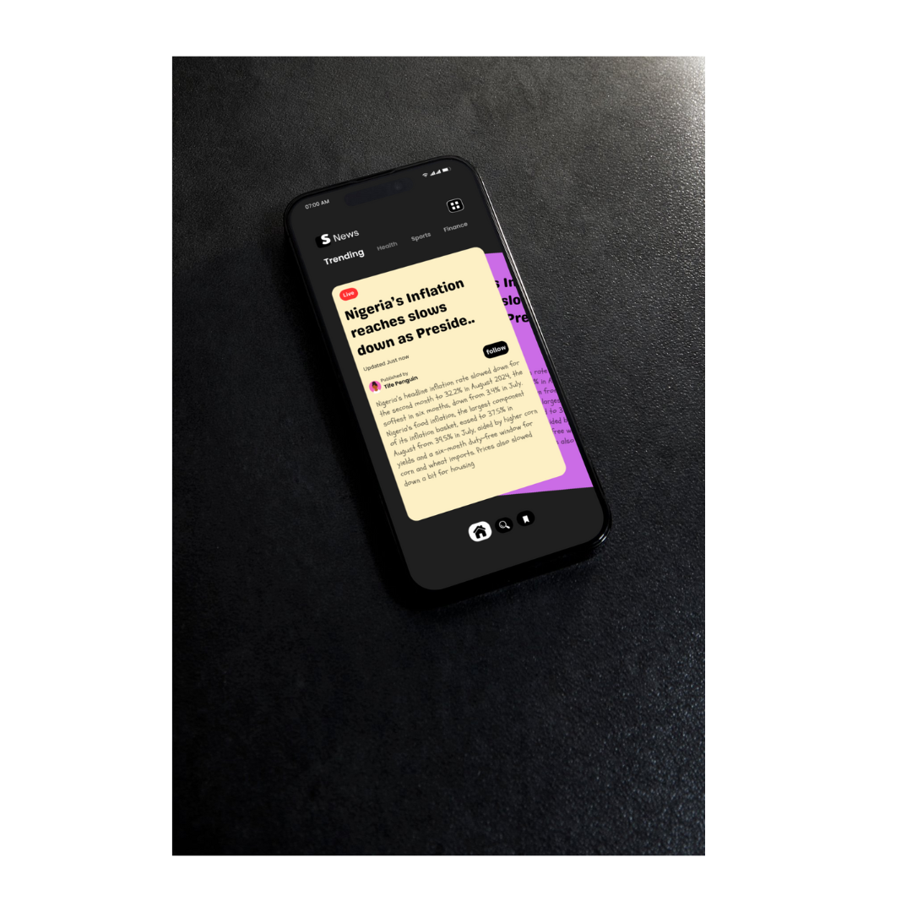

# Swoosh - Gen Z News App

## Overview
Swoosh is a Flutter-based news application designed to deliver news in a format that resonates with the Gen Z audience. The app utilizes a combination of a news API, a scraper service, and a caching mechanism to provide users with a seamless and engaging news experience.

### Screenshots




### Features
- **News API Integration**: The app fetches the latest news articles using a news API, allowing users to stay updated with current events.
- **Scraper Service**: In addition to the API, a scraper service is employed to extract content from various sources, ensuring that users receive comprehensive news coverage.
- **Cache Service**: To enhance performance and reduce loading times, a caching service is implemented. This allows the app to store previously fetched news articles and serve them quickly when needed.

### User Experience
- **Swipe Navigation**: Embracing the swiping culture popularized by social media, users can swipe left to view the next news article. This intuitive gesture makes browsing through news articles feel natural and engaging.

### AI Integration
- The app aims to incorporate AI technologies to refine and clean the news content, making it more relatable and appealing to the Gen Z demographic. This includes summarizing articles, highlighting key points, and presenting information in a visually appealing manner.

## Getting Started
To get started with the Swoosh app, clone the repository and run the following commands:

```
flutter pub get
flutter run 
```

## Contributing
Contributions are welcome! If you have suggestions for improvements or new features, feel free to open an issue or submit a pull request.

## License
This project is licensed under the MIT License - see the [LICENSE](LICENSE) file for details.

## Acknowledgments
- Thanks to the developers of the news API and the scraper service for providing the tools necessary to build this application.
- Special thanks to the Flutter community for their continuous support and resources.

